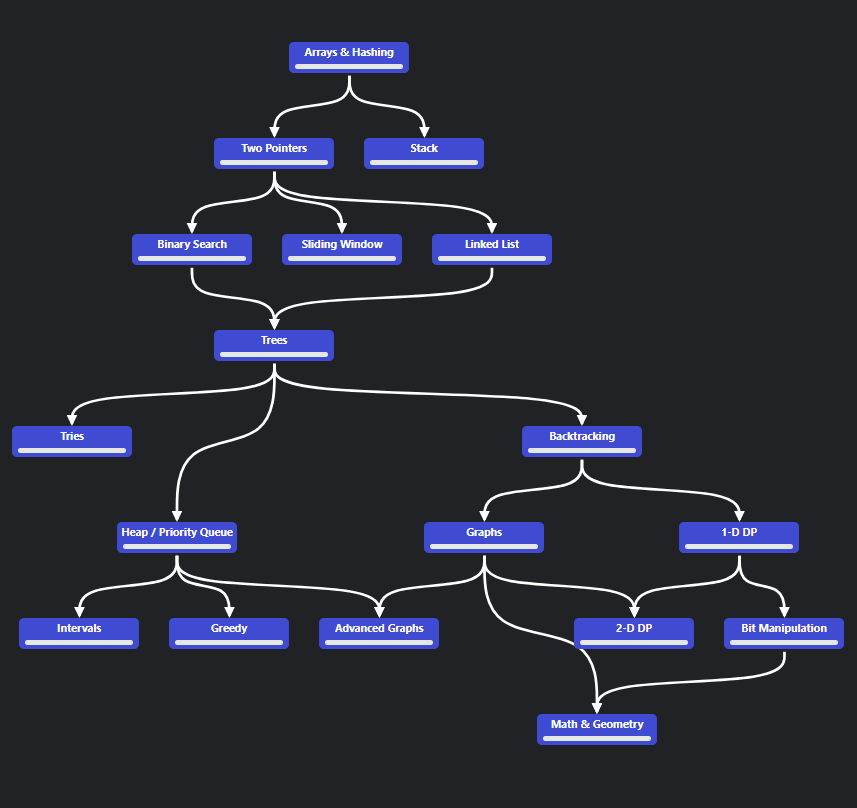

# Leetcode

Swift solutions for [Neetcode's Algorithm Roadmap](https://neetcode.io/roadmap) leetcode problems



---

| |  | Arrays and Hashing | | | |
| -- | -- | -- | -- | -- | -- |
|✅| 217 | Contains Duplicate |  | [src](./Sources/leetcode/217/ContainsDuplicate.swift) | [url](https://leetcode.com/problems/contains-duplicate/) |
|✅| 242 | Valid Anagram |  | [src](./Sources/leetcode/242/ValidAnagram.swift) | [url](https://leetcode.com/problems/valid-anagram/) |
|✅| 1 | Two Sum |  | [src](./Sources/leetcode/1/TwoSum.swift) | [url](https://leetcode.com/problems/two-sum/) |
|✅| 49 | Group Anagrams |  | [src](./Sources/leetcode/49/GroupAnagrams.swift) | [url](https://leetcode.com/problems/group-anagrams/) |
|✅| 347 | Top K Frequent Elements |  | [src](./Sources/leetcode/347/TopKFrequentElements.swift) | [url](https://leetcode.com/problems/top-k-frequent-elements/) |
|✅| 238 | Product of Array Except Self |  | [src](./Sources/leetcode/238/ProductExceptSelf.swift) | [url](https://leetcode.com/problems/product-of-array-except-self/) |
|✅| 36 | Valid Sudoku |  | [src](./Sources/leetcode/36/ValidSudoku.swift) | [url](https://leetcode.com/problems/valid-sudoku/) |
|✅| 271 | Encode and Decode Strings |  | [src](./Sources/leetcode/271/EncodeAndDecodeStrings.swift) | [url](https://leetcode.com/problems/encode-and-decode-strings/) |
|✅| 128 | Longest Consecutive Sequence |  | [src](./Sources/leetcode/128/LongestConsecutiveSequence.swift) | [url](https://leetcode.com/problems/longest-consecutive-sequence/) |

| | | Two Pointers | | | |
| -- | -- | -- | -- | -- | -- |
|✅| 125 | Valid Palindrome |  | [src](./Sources/leetcode/125/ValidPalindrome.swift)  | [url](https://leetcode.com/problems/valid-palindrome/) |
|❌| 167 | Two Sum II Input Array Is Sorted |  |  | [url](https://leetcode.com/problems/two-sum-ii-input-array-is-sorted/) |
|❌| 15 | 3Sum |  |  | [url](https://leetcode.com/problems/3sum/) |
|❌| 11 | Container With Most Water |  |  | [url](https://leetcode.com/problems/container-with-most-water/) |
|❌| 42 | Trapping Rain Water |  |  | [url](https://leetcode.com/problems/trapping-rain-water/) |

| | | Stack | | | |
| -- | -- | -- | -- | -- | -- |
|✅| 20 | Valid Parentheses |  | [src](./Sources/leetcode/20/ValidParentheses.swift)  | [url](https://leetcode.com/problems/valid-parentheses/) |
|✅| 155 | Min Stack |  | [src](./Sources/leetcode/155/MinStack.swift) | [url](https://leetcode.com/problems/min-stack/) |
|❌| 150 | Evaluate Reverse Polish Notation |  |  | [url](https://leetcode.com/problems/evaluate-reverse-polish-notation/) |
|❌| 22 | Generate Parentheses |  |  | [url](https://leetcode.com/problems/generate-parentheses/) |
|❌| 739 | Daily Temperatures |  |  | [url](https://leetcode.com/problems/daily-temperatures/) |
|❌| 853 | Car Fleet |  |  | [url](https://leetcode.com/problems/car-fleet/) |
|❌| 84 | Largest Rectangle in Histogram |  |  | [url](https://leetcode.com/problems/largest-rectangle-in-histogram/) |

| | | Binary Search | | | |
| -- | -- | -- | -- | -- | -- |
|❌| 704 | Binary Search |  |  | [url](https://leetcode.com/problems/binary-search/) |
|❌| 74 | Search a 2D Matrix |  |  | [url](https://leetcode.com/problems/search-a-2d-matrix/) |
|❌| 875 | Koko Eating Bananas |  |  | [url](https://leetcode.com/problems/koko-eating-bananas/) |
|❌| 153 | Find Minimum in Rotated Sorted Array |  |  | [url](https://leetcode.com/problems/find-minimum-in-rotated-sorted-array/) |
|❌| 33 | Search in Rotated Sorted Array |  |  | [url](https://leetcode.com/problems/search-in-rotated-sorted-array/) |
|❌| 981 | Time Based Key-Value Store |  |  | [url](https://leetcode.com/problems/time-based-key-value-store/) |
|❌| 4 | Median of Two Sorted Arrays |  |  | [url](https://leetcode.com/problems/median-of-two-sorted-arrays/) |

| | | Sliding Window | | | |
| -- | -- | -- | -- | -- | -- |
|❌| 121 | Best Time to Buy And Sell Stock |  |  | [url](https://leetcode.com/problems/best-time-to-buy-and-sell-stock/) |
|❌| 3 | Longest Substring Without Repeating Characters |  |  | [url](https://leetcode.com/problems/longest-substring-without-repeating-characters/) |
|❌| 424 | Longest Repeating Character Replacement |  |  | [url](https://leetcode.com/problems/longest-repeating-character-replacement/) |
|❌| 567 | Permutation In String |  |  | [url](https://leetcode.com/problems/permutation-in-string/) |
|❌| 76 | Minimum Window Substring |  |  | [url](https://leetcode.com/problems/minimum-window-substring/) |
|❌| 239 | Sliding Window Maximum |  |  | [url](https://leetcode.com/problems/sliding-window-maximum/) |

| | | Linked List | | | |
| -- | -- | -- | -- | -- | -- | 
|❌| 206 | Reverse Linked List |  |  | [url](https://leetcode.com/problems/reverse-linked-list/) |
|❌| 21 | Merge Two Sorted Lists |  |  | [url](https://leetcode.com/problems/merge-two-sorted-lists/) |
|❌| 141 | Linked List Cycle |  |  | [url](https://leetcode.com/problems/linked-list-cycle/) |
|❌| 143 | Reorder List |  |  | [url](https://leetcode.com/problems/reorder-list/) |
|❌| 19 | Remove Nth Node From End of List |  |  | [url](https://leetcode.com/problems/remove-nth-node-from-end-of-list/) |
|❌| 138 | Copy List With Random Pointer |  |  | [url](https://leetcode.com/problems/copy-list-with-random-pointer/) |
|❌| 2 | Add Two Numbers |  |  | [url](https://leetcode.com/problems/add-two-numbers/) |
|❌| 287 | Find The Duplicate Number |  |  | [url](https://leetcode.com/problems/find-the-duplicate-number/) |
|❌| 146 | LRU Cache  |  |  | [url](https://leetcode.com/problems/lru-cache/) |
|❌| 23 | Merge K Sorted Lists |  |  | [url](https://leetcode.com/problems/merge-k-sorted-lists/) |
|❌| 25 | Reverse Nodes In K Group |  |  | [url](https://leetcode.com/problems/reverse-nodes-in-k-group/) |

| | | Trees | | | |
| -- | -- | -- | -- | -- | -- | 
|✅| 226 | Invert Binary Tree  |  | [src](./Sources/leetcode/226/InvertBinaryTree.swift) | [url](https://leetcode.com/problems/invert-binary-tree/) |
|❌| 104 | Maximum Depth of Binary Tree  |  |  | [url](https://leetcode.com/problems/maximum-depth-of-binary-tree/) |
|❌| 543 | Diameter of Binary Tree  |  |  | [url](https://leetcode.com/problems/diameter-of-binary-tree/) |
|❌| 110 | Balanced Binary Tree  |  |  | [url](https://leetcode.com/problems/balanced-binary-tree/) |
|❌| 100 | Same Tree  |  |  | [url](https://leetcode.com/problems/same-tree/) |
|❌| 572 | Subtree of Another Tree  |  |  | [url](https://leetcode.com/problems/subtree-of-another-tree/) |
|❌| 235 | Lowest Common Ancestor of a Binary Search Tree  |  |  | [url](https://leetcode.com/problems/lowest-common-ancestor-of-a-binary-search-tree/) |
|❌| 102 | Binary Tree Level Order Traversal  |  |  | [url](https://leetcode.com/problems/binary-tree-level-order-traversal/) |
|❌| 199 | Binary Tree Right Side View  |  |  | [url](https://leetcode.com/problems/binary-tree-right-side-view/) |
|❌| 1448 | Count Good Nodes In Binary Tree  |  |  | [url](https://leetcode.com/problems/count-good-nodes-in-binary-tree/) |
|❌| 98 | Validate Binary Search Tree  |  |  | [url](https://leetcode.com/problems/validate-binary-search-tree/) |
|❌| 230 | Kth Smallest Element In a Bst  |  |  | [url](https://leetcode.com/problems/kth-smallest-element-in-a-bst/) |
|❌| 105 | Construct Binary Tree From Preorder And Inorder Traversal  |  |  | [url](https://leetcode.com/problems/construct-binary-tree-from-preorder-and-inorder-traversal/) |
|❌| 124 | Binary Tree Maximum Path Sum  |  |  | [url](https://leetcode.com/problems/binary-tree-maximum-path-sum/) |
|❌| 297 | Serialize And Deserialize Binary Tree  |  |  | [url](https://leetcode.com/problems/serialize-and-deserialize-binary-tree/) |


| | | Tries | | | |
| -- | -- | -- | -- | -- | -- | 
| | | | | | |

| | | Backtracking | | | |
| -- | -- | -- | -- | -- | -- | 
| | | | | | |

| | | Heap / Priority Queue | | | |
| -- | -- | -- | -- | -- | -- | 
| | | | | | |

| | | Graphs | | | |
| -- | -- | -- | -- | -- | -- |
| | | | | | |
 
| | | 1-D DP | | | |
| -- | -- | -- | -- | -- | -- | 
| | | | | | |

| | | Intervals | | | |
| -- | -- | -- | -- | -- | -- | 
| | | | | | |

| | | Greedy | | | |
| -- | -- | -- | -- | -- | -- | 
| | | | | | |

| | | Advanced Graphs | | | |
| -- | -- | -- | -- | -- | -- | 
| | | | | | |

| | | 2-D DP | | | |
| -- | -- | -- | -- | -- | -- | 
| | | | | | |

| | | Bit Manipulation | | | |
| -- | -- | -- | -- | -- | -- |

| | | Math & Geography | | | |
| -- | -- | -- | -- | -- | -- | 
| | | | | | |

## Testing

XCTests can be ran through Xcode or VS Code (with Swift extension), as well as with the following command:

```
swift test
```
